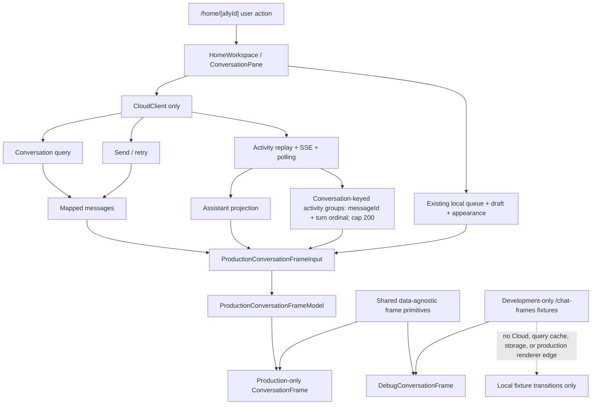

# Pixel-perfect Web Chat Frames Implementation Plan

## Feature Overview

- **Problem:** The current `/home/[allyId]` conversation is functional, but its mobile composition and state presentation do not yet match the supplied 375 × 812 chat handoff. The handoff also contains rich cart, image, routine, approval, queue, failure, and lifecycle states that are not all represented by current Cloud DTOs.
- **Target users:** M2 internal-alpha users talking to an Ally on the web, plus product, design, and engineering reviewers who need deterministic evidence for every requested handoff state.
- **Source docs/specs:** `docs/plans/chat-frames-brief.md`; `docs/plans/chat-frames.adversarial.md`; `AGENTS.md`; `ENGINEERING_STYLE.md`; `apps/web/AGENTS.md`; `apps/web/CLAUDE.md`; `docs/templates/PLAN_TEMPLATE.md`; the Nabu Allies index, current-delivery note, product design spec, conversation-and-streaming spec, Interface development guide, and technical architecture; immutable Aphrodite import `df3eb62c0b54964800ee8dbc6ae2927bdb6b22c86c0f0b5a2364d5d9779f491b` (alias `handoff`, Figma format 106) on the `product` page; the required external Web Interface Guidelines; and the bundled Next.js 16.2.12 documentation listed below.
- **Success outcome:** One responsive conversation presentation matches all 25 in-scope frames at the reference viewport, preserves existing Cloud-backed messaging behavior, keeps unsupported rich states inside a production-disabled synthetic fixture harness, and adds no backend contract, dependency, mobile change, or alternate source of truth.

## Plan Hygiene and Evidence Boundaries

This plan records repository-relative paths, public contract names, synthetic design fixtures, and the immutable Aphrodite import identity. It does not record the local design-source path, private runtime URLs, live account data, or cache paths. The source `.fig` file must not be copied into the repository. Any resolved design asset needed for visual QA must be deduplicated, renamed, checksummed, and stored inside the server-guarded debug fixture module; production code must not load from an Aphrodite cache or expose a synthetic asset through `public/`.

### Evidence inspected

- Branch and base: `web/feat/chat-frames` targets `dev`; the branch is updated with the current base before delivery.
- Workflow: `.agent/kickoff.yaml` selects `sol_planning_worker` for planning. No selector override is part of this plan.
- Current web ownership: `apps/web/app/home/home-workspace.tsx` owns session restoration, account and Ally queries, preview queries, the selected conversation query, older-page cursors, the activity replay/stream/poll loop, local queued messages, idempotent send/retry behavior, follow-latest scrolling, provisioning states, and Ally appearance resolution.
- Current presentation: `apps/web/app/home/home.module.css` provides the roster/thread split, a single-thread layout below 1024 px, safe-area padding, messages, queued messages, composer, focus styles, and reduced-motion overrides. It does not yet encode the reference mobile geometry or rich handoff surfaces.
- Existing UI assets: `apps/web/components/ally-avatar.tsx` already resolves the four Ally shapes, idle/thinking authored SVGs, and reduced-motion variants. `apps/web/app/layout.tsx` owns the Open Runde 400/500/600/700 font files and the light viewport configuration.
- Existing data shapes: `packages/cloud-client/src/mappers/allies.ts` exposes string-only `MessageViewModel` content and activity events with required `messageId`, `conversationTurnOrdinal`, `kind`, `text`, `state`, and global `sequence`. It has no typed attachment, product, cart, routine, approval, report, or lifecycle payload, and no corresponding mutation is exposed by `packages/cloud-client/src/client.ts`.
- Existing activity behavior: `packages/cloud-client/src/activity-projection.ts` projects assistant deltas and terminal state but does not retain a product-facing activity list for disclosure. Web replay is bounded to 64 pages and 4 MiB, snapshots to 200 activities, polling to 240 checks at 500 ms, and streaming falls back to polling.
- Existing regression coverage: `apps/web/app/home/home-workspace.test.tsx` covers empty and selected workspaces, provisioning, mobile navigation, older cursors, queue persistence/removal/dispatch, idempotent send/retry, history preservation, activity gaps, polling/stream aborts, markdown streaming, reconciliation, refresh failures, runtime-copy suppression, and sign-out redirect.
- Existing debug convention: `apps/web/app/(debug)/animation/page.tsx` currently permits development, preview, and staging. The chat-frame harness deliberately uses a stricter server-only guard: development is allowed; preview, staging, and production are denied by default.
- Existing browser tooling: `apps/web/playwright.config.ts` is scoped to onboarding. The chat-frame suite therefore gets a dedicated config rather than changing the onboarding test root.
- Aphrodite: alias `handoff` resolves to immutable import ID `df3eb62c0b54964800ee8dbc6ae2927bdb6b22c86c0f0b5a2364d5d9779f491b`, Figma format 106. All 25 requested node IDs were resolved at 375 × 812 with complete text evidence. The screen inventory was reconfirmed during this revision, but the earlier low-level raster/vector diagnostics were compacted and a bounded retry did not yield a complete 25-frame asset inventory. Asset evidence is therefore explicitly provisional, not complete, until the per-frame extraction and disposition gate below passes.
- Review record: `docs/plans/chat-frames.adversarial.md` contains the first adversarial review, the second adversarial review, and the simplicity review dated 2026-09-03. The findings remain durable; this revision addresses all recorded findings while keeping owner-dependent gates explicit below.
- Required external guidance: the Web Interface Guidelines were fetched on 2026-09-03. Relevant requirements include keyboard operation, visible focus, 44 px mobile hit targets, safe areas, resilient long content, explicit status text, focus-managed dialogs, intrinsic responsive layout, reduced motion, and image dimensions that prevent layout shift.
- Bundled framework guidance: Bun hoists Next.js, so `apps/web/node_modules/next/dist/docs/` is absent while `apps/web` resolves Next 16.2.12 from `node_modules/next`. The equivalent bundled docs inspected were `01-app/01-getting-started/03-layouts-and-pages.md`, `05-server-and-client-components.md`, `11-css.md`, `12-images.md`, `01-app/03-api-reference/01-directives/use-client.md`, `04-functions/use-search-params.md`, `03-architecture/accessibility.md`, and the Vitest and Playwright testing guides. They support a server page with awaited `searchParams`, a narrow client boundary for interactions, scoped CSS Modules, static public assets with dimensions, and browser E2E coverage.

### Evidence boundaries

- The 25 frame fixtures may reproduce handoff copy, geometry, and resolved design assets because they are synthetic review data. They must never be passed to `CloudClient`, stored in TanStack Query, mixed into real conversation history, or used as a fallback when Cloud data is absent.
- A first approved browser screenshot is a regression baseline, not proof of fidelity by itself. Product/design must compare each initial baseline with its named Aphrodite frame before it is accepted. Future snapshot updates require the same comparison.
- Mobile operating-system status indicators and the home indicator are reference chrome. The web app reserves safe-area space but does not draw OS chrome. Frame comparisons mask those system-owned regions.
- Exact handoff typos or placeholder copy may remain in debug fixtures for visual fidelity. Production copy continues to come from Cloud messages or explicit local product-language mappings.

### Immutable visual manifest and sign-off

- `apps/web/tests/chat-frames/chat-frame-visual-manifest.json` is the machine-readable source of visual truth for this slice. Its header records `schemaVersion: 1`, provider `aphrodite`, alias `handoff`, import ID `df3eb62c0b54964800ee8dbc6ae2927bdb6b22c86c0f0b5a2364d5d9779f491b`, Figma format `106`, page `product`, the 375 × 812 reference viewport, the explicit exclusion `315:1827`, and `evidenceStatus: "provisional" | "complete"` with unresolved-reason records.
- The manifest contains exactly the same 25 IDs as `CHAT_FRAME_IDS`. Every frame entry records its node ID and name; normalized text/content lines; measured frame, header, content-rail, message, card/sheet, and composer bounds where present; typography, color, radius, and clipping facts; the expected snapshot path; and an `assets` array containing every material Aphrodite asset discovered anywhere in that node subtree. Symbolic labels such as `existing-ally-art` or `native-icon` are forbidden as final evidence.
- Every material asset record must name its Aphrodite `canonicalNodeId`, `kind`, `rawReference`, diagnostic status, and one exclusive disposition: (a) `tracked-copy` with repository path, byte SHA-256, MIME type, and intrinsic dimensions; (b) `verified-reuse` with exact existing repository path and byte SHA-256; (c) `masked-os-chrome` with exact mask rectangle and rationale; or (d) `css-native-substitution` with the implementing component/CSS token or rule, the source bounds/style facts it preserves, named approver, approval timestamp, and durable approval reference. A missing/invalid/unsupported Aphrodite record stays `unresolved` with its reason code. Paths into `.aphrodite`, the source `.fig`, generic labels, and unapproved substitutions fail completeness.
- Bounded `get_design_context` extraction runs separately for each of the 25 frame IDs with advertised `truncation` captured. A frame is complete only when `truncated` is false, `omittedAssets` is zero, and every returned material asset has exactly one disposition. If a subtree must be queried separately, the manifest records those bounded query roots and proves union coverage. Any unresolved asset or incomplete/truncated diagnostic keeps the whole manifest `provisional` and blocks approved baseline creation and sign-off; provisional screenshots may still be generated for diagnosis under the prebaseline mode below.
- Each frame has `evidenceSha256`, computed from canonical UTF-8 JSON containing the immutable import ID plus that frame's normalized measurement/content/asset payload. `apps/web/tests/chat-frames/chat-frame-visual-manifest.sha256` stores the SHA-256 of the entire canonical manifest. `verify-chat-frame-manifest.ts` recomputes the manifest, frame, and resolved asset digests, rejects duplicate/missing IDs, and proves set equality with the 25 fixture IDs and snapshots.
- `apps/web/tests/chat-frames/chat-frame-baseline-signoff.json` is a separate durable approval record. It can record the manifest SHA-256, source import ID, implementation commit, pinned runtime fingerprint, 25 snapshot paths and byte hashes, approver, timestamp, and approval reference. Its strict verifier remains available for product/design provenance, but the automated test suite does not fabricate approval metadata or fail by design while that record is provisional.
- Any manifest, fixture, asset, runtime fingerprint, or approved snapshot change invalidates the sign-off and requires a new side-by-side review. The source `.fig` file and Aphrodite cache are never committed.

#### Baseline lifecycle and verifier modes

The lifecycle has two deliberately different gates; no command may alias one to the other:

1. `verify:chat-frames:prebaseline` runs `verify-chat-frame-manifest.ts --mode=prebaseline` and `verify-chat-frame-runtime.ts`. It requires immutable source identity, the exact 25-ID set and exclusion, canonical JSON/checksums for all evidence currently present, no private/cache/source paths, valid fixture/snapshot destinations, and the pinned capture runtime. It permits the approver sentinel, absent capture hashes, and `evidenceStatus: "provisional"`; it prints and writes the unresolved reasons so generated captures cannot be mistaken for approved evidence.
2. `test:chat-frames:update` invokes only `verify:chat-frames:prebaseline`, then Chromium with `--update-snapshots`. It never calls `verify:chat-frames:signoff`, and CI never runs this command or any `--update-snapshots` variant.
3. After product/design reviews the captures, the approver may record every capture hash and the durable sign-off fields. `verify:chat-frames:signoff` validates that optional provenance record strictly; it is separate from the automated CI command.
4. `test:chat-frames` validates the pinned runtime, manifest consistency, production-bundle boundary, browser behavior, geometry, and committed snapshots. Human baseline sign-off remains a separate evidence record and never makes the automated suite intentionally red.

#### Per-frame asset evidence

The machine-readable manifest is the single asset ledger. It contains exactly the 25 in-scope frame IDs and one entry for every material asset in each frame subtree; the human-readable frame matrix below describes state and behavior only. The manifest verifier requires each asset's canonical Aphrodite node ID, kind, raw reference, diagnostic status, one exclusive disposition, byte/path evidence where applicable, and approval evidence for CSS/native substitutions. It also records exact OS-chrome mask rectangles only after confirming those regions are system-owned. Because the compacted Aphrodite diagnostics were not fully recovered, the current manifest remains `provisional`; no row-by-row prose copy is treated as evidence, and sign-off cannot pass until the manifest itself is complete.

### Adversarial review disposition

| Finding | Revision disposition | Enforced by |
| --- | --- | --- |
| 1. Activity correctness | Replaced the flat display log with conversation state grouped by compound `messageId` + `conversationTurnOrdinal`, exact turn placement, deterministic replay, reset, and global cap eviction. | Activity contract, turn-block data path, reducer/model tests, acceptance 6 and 8. |
| 2. Fixture isolation | Narrowed `ConversationFrame` to production model/actions and moved all rich unions/actions/rendering into `DebugConversationFrame`. | ESLint restrictions, two named static source-graph tests, acceptance 2 and 13. |
| 3. Visual proof | Pinned immutable import ID/format and defined complete 25-frame manifest, per-frame/asset/manifest hashes, named approver slot, and durable sign-off. | Manifest verifier, inventory tests, sign-off gate, acceptance 25. |
| 4. Regression enforcement | Added stable package scripts, pinned runtime/browser checks inside the main CI suite, retained reports/traces/diffs, and hard failure rules. | `test:chat-frames`, `Interface CI suite`, branch protection. |
| 5. Permissions | Defined final 401/403/404 behavior for load, send, retry, and activity, including clearing, aborts, preservation, and unavailable retries. | Access-classifier/model tests, authorization matrix, D-15 manual controller verification, acceptance 9–10. |
| 6. Debug exposure | Chose development-only page and asset access; all deployed environments fail closed pending a separate authenticated design. | Shared server guard, page/asset environment tests, acceptance 12. |
| 7. Browser/responsive coverage | Named pinned Chromium/WebKit/Firefox projects, full Chromium layout/interaction coverage, representative Firefox/WebKit behavior checks, and separate actual Safari verification. | Browser matrix, Playwright behavior suite, manual sign-off. |

### Second adversarial review disposition

| Finding | Revision disposition | Enforced by |
| --- | --- | --- |
| 1. Baseline lifecycle | Keep snapshot creation explicit and separate from comparison. CI verifies the pinned runtime, manifest integrity, production boundary, and committed snapshots; strict human sign-off remains an evidence command rather than an intentionally failing automated gate. | Verifier modes, package-script contracts, Phase 3, acceptance 25–26. |
| 2. CI target branch | Target `dev` and run the chat-frame checks inside the existing required `Interface CI suite`. | Workflow impact, command checks, D-10. |
| 3. Boundary proof | Expanded static resolution to imports/exports, aliases, barrels, dynamic imports, and CommonJS; added a post-build graph/output assertion as defense in depth. | Boundary tests, production bundle verifier, Phase 1/3, acceptance 13–14. |
| 4. Asset evidence | Replaced symbolic asset proof with the complete disposition schema and a provisional machine-readable manifest; unresolved/truncated diagnostics block approved baseline/sign-off. | Manifest modes, manifest completeness rule, Phase 2, acceptance 25–26. |
| 5. CI artifacts | Added deterministic path validation before upload and `if-no-files-found: error`; always-present reports/results and baseline images are separated from conditional failure-only traces/actual/diff outputs. | CI contract, artifact verifier, Phase 3, D-14. |

## User Stories

1. As an internal-alpha user, I want the web conversation to preserve my Ally's identity, history, and familiar mobile composition so that the experience feels continuous and trustworthy.
2. As a user sending work to an active Ally, I want clear thinking, activity, queue, retry, failed, stopped, waiting, and completed states so that I know what is happening and how to recover.
3. As a keyboard or reduced-motion user, I want every action and overlay to remain operable, labelled, focused, and understandable without motion or color alone.
4. As a product or design reviewer, I want a deterministic representation of every requested frame so that I can compare geometry, content, and state transitions without relying on a live backend.
5. As an Interface engineer, I want real data ownership to stay in `HomeWorkspace` and all unsupported rich examples to remain isolated so that visual work cannot create a shadow Cloud contract.

## Scope

### In Scope

- Extract a pure, page-owned conversation presentation model and component from the current `ConversationPane` markup while leaving its controller effects and Cloud operations in `home-workspace.tsx`.
- Refine the narrow web layout to the verified 375 × 812 anchors: 20 px content gutters, a 335 px content rail, 40 px visible header circles with at least 44 px hit areas, a 48 px collapsed composer, Open Runde typography, verified colors/radii, safe-area offsets, and natural vertical scrolling.
- Preserve the existing desktop roster + thread navigation at 1024 px and above and the roster-first mobile route behavior below it.
- Render real string messages, assistant streaming output, message/turn-scoped product-facing activity text, thinking/working/waiting/failure states, single and multiple local queue items, send failure, and message retry from existing web and Cloud state.
- Make production rendering structurally narrow: `ConversationFrame` accepts only `ProductionConversationFrameModel` and production actions. Synthetic product carousel, image lightbox, cart, routine, approval, report acknowledgement, and sleep/wake unions, actions, and render branches live exclusively under the debug route and reuse only data-agnostic visual primitives.
- Add a development-only `/chat-frames` review route with exactly 25 URL-selectable synthetic fixtures and local-only interactions. Preview, staging, and production return not-found unless a later, separately reviewed server-side authenticated/secret guard is explicitly implemented.
- After complete per-frame Aphrodite extraction, store only the material assets whose manifest disposition is `tracked-copy` under the guarded debug fixture module; deduplicate only byte-identical sources, hash every tracked/reused asset, and serve fixture-only copies through the same development-only server boundary. Do not place synthetic handoff assets in `public/`; the manifest, not prose or a shared filename assumption, determines whether two frames reuse one asset.
- Add the 25-frame visual manifest, checksum, provisional/approved sign-off lifecycle, focused unit/component and exhaustive static import-boundary tests, a post-production-build graph assertion, plus a dedicated required Playwright CI gate with approved baselines.

### Out of Scope

- Any change to Allies Cloud, Hermes, Foundry, Fly, an API schema, generated OpenAPI, authentication protocol, authorization policy, or event vocabulary. The web will classify existing `CloudError` kinds and fail closed; it will not invent capabilities.
- Production cart, purchase, product-selection, attachment, routine, approval, report, or deletion behavior. No current typed payload or mutation supports those actions.
- Mapping `AllyViewModel.provisioningState` to Sleeping or Waking. Provisioning and runtime lifecycle are different concepts.
- New global state, Zustand stores, query keys, persistent fixture storage, analytics events, feature flags, dependencies, or a general-purpose conversation design system.
- Changes under `apps/mobile`, including implementation of `315:1827` (`chat ~ keyboard state`).
- Drawing mobile OS status bars, keyboards, home indicators, or browser chrome.
- Replacing the current desktop roster, production route structure, activity replay strategy, queue key/version, or send/retry idempotency rules.
- Public preview/staging access to synthetic frames. If an owner later requires it, that is a follow-up security decision requiring a server-only secret or authenticated capability, constant-time validation, audit-safe configuration, and its own environment tests.

### Dependencies and Assumptions

- `HomeWorkspace` and `ConversationPane` remain the production controller and retain the current Cloud-only call path.
- The real Ally accent remains resolved from `AllyViewModel.appearance`; the synthetic Sally fixtures use the handoff accent `#FF2D55`/`#FD304F`.
- Existing idle artwork represents static Sleep fixtures and existing thinking artwork represents Thinking/Waking fixtures until dedicated lifecycle artwork and a Cloud signal are specified. Fixture labels, not an invented runtime mapping, carry the lifecycle meaning.
- Production activity disclosure may render only non-empty text from allowlisted product-facing activity kinds (`activity_started`, `activity_completed`, and `awaiting_action`). `assistant_delta` remains response text; execution envelope kinds and enum names are never printed. Every retained display event is keyed to both `messageId` and `conversationTurnOrdinal`.
- The web-only activity state retains the latest 200 allowlisted entries across the current conversation, sorted and deduplicated by global `sequence` plus deterministic `id` tie-break. It groups entries by `${messageId}:${conversationTurnOrdinal}`, anchors each group to that exact user message, and never assigns unmatched activity to the latest turn. Cloud remains the durable source; this is a bounded presentation cache, not a second history store.
- The visual harness uses fixed synthetic time/content, light color scheme, Open Runde, reduced motion, locale `en-US`, timezone `UTC`, a 1× device scale factor, and simulated 44 px top / 34 px bottom safe areas for deterministic 375 × 812 captures. The frozen lock resolves Playwright 1.62.1 with Chromium 151.0.7922.34 (revision 1234), WebKit 26.5 (revision 2336 on Ubuntu 24.04), and Firefox 153.0 (revision 1538); the verifier fails on drift.
- The implementation PR targets `dev`. The existing required `Interface CI suite` covers that branch and includes the chat-frame regression checks.
- The manifest is intentionally provisional at planning handoff because compacted Aphrodite diagnostics were not fully recoverable in the bounded retry. This does not block automated consistency, boundary, behavior, geometry, or snapshot checks; it blocks only strict product/design provenance acceptance through `verify:chat-frames:signoff`.
- The direct `design.md` response could not be consumed by the browser fetcher because of its Markdown content type, and the shell host could not resolve it. The canonical HTML rendering at the same site's `/design/guidelines` route was fetched and read in full. This is sufficient for the design-authority requirements but remains recorded as a source-access limitation.
- The prescribed `humanizer` skill is not installed or discoverable. The final Markdown receives the required `better-docs` check and a manual human-language pass without altering commitments or contracts.

## Selected Approach

Use a small presentation extraction, not a second chat controller. `ConversationPane` derives only `ProductionConversationFrameModel` and passes existing production callbacks to `ConversationFrame`. `ConversationFrame` cannot accept a rich union, render prop, synthetic action, or arbitrary timeline child. A separate debug-only `DebugConversationFrame` owns every rich union, action, fixture, and branch while importing shared data-agnostic frame primitives for visual consistency. ESLint restrictions and a source-graph test make the one-way boundary executable rather than relying on TypeScript intent alone.

| Concern | Current | Planned target | Decision basis |
| --- | --- | --- | --- |
| Production ownership | Query, replay, polling, queue, retry, scroll, appearance, and markup coexist in `ConversationPane`. | The same controller retains all effects; only pure model derivation and rendering move out. | Lowest-risk extraction from a 1,600+ line file; no competing source of truth. |
| Mobile composition | Generic responsive thread with 12–20 px offsets, 44 px identity in the header, and a 54 px minimum composer. | Reference-aligned content rail, icon header, timeline identity/date, 48 px collapsed composer, safe-area variables, and fluid fallback below/above 375 px. | Aphrodite geometry plus current responsive route behavior. |
| Activity display | Activity drives assistant deltas and terminal notices; completed tool steps are not retained for disclosure. | A bounded conversation state groups allowlisted entries by `messageId` + `conversationTurnOrdinal`; each group stays inside the triggering user turn through replay and multiple turns. | Existing required Cloud fields are sufficient; no new transport shape or latest-turn guess. |
| Rich cards and overlays | No typed product, cart, image, routine, approval, report, deletion, or lifecycle model exists. | `ConversationFrame` is production-only. A debug-only model and renderer own every synthetic branch/action and import only shared visual primitives. | Covers the handoff without making a synthetic union reachable from production. |
| Debug exposure | Existing animation debug route permits development, preview, and staging. | Chat frames and their extracted asset return not-found outside development. | Safest default while no preview/staging access owner or capability exists. |
| Visual verification | Existing unit coverage, no chat-frame browser suite. | Immutable 25-frame manifest, explicit snapshot-update command, hard geometry assertions, three-engine behavior projects, retained failure artifacts, and the required `Interface CI suite` on `dev`. | Pixel fidelity needs deterministic, attributable evidence without a circular first-capture gate. |
| Alternatives rejected | Keep all markup inline, or build a second fixture-only copy of the chat. | Neither is selected. | Inline markup prevents isolated visual testing; a duplicate chat would drift from production. |

## Contract and Shape Definitions

### Function and Service Shapes

| Location | Symbol | Signature | Inputs and validation | Return value | Side effects / errors |
| --- | --- | --- | --- | --- | --- |
| `apps/web/lib/allies/activity-presentation.ts` | `mergeActivityPresentation` | `(current: ActivityPresentationState, input: { conversationId: string; activities: readonly ActivityViewModel[] }, limit?: number) => ActivityPresentationState` | On a new `conversationId`, reset before merge. Keep non-empty allowlisted kinds; identify a group by both `messageId` and `conversationTurnOrdinal`; dedupe entries by global `sequence` with deterministic `id` tie-break; clamp limit to 1–200 and default to 200. | Conversation-keyed state with ordered turn groups, latest 200 entries, and `evictedBeforeSequence` metadata. | Pure. Out-of-order/replayed entries merge into their original group; stale input for a no-longer-current conversation is rejected by the caller's captured conversation ID. |
| `apps/web/app/home/conversation-frame-model.ts` | `buildProductionConversationFrameModel` | `(input: ProductionConversationFrameInput) => ProductionConversationFrameModel` | Receives resolved Ally presentation, merged messages, current `ActivityProjection`, `ActivityPresentationState`, queue, draft, classified access state, and explicit controller flags. It accepts no raw API payload. | Stable timeline/header/composer/status model whose type contains production-supported variants only. | Pure; anchors groups to exact message/turn blocks, formats safe labels, and cannot represent rich fixture items. |
| `apps/web/app/home/conversation-access-error.ts` | `classifyConversationAccessError` | `(error: unknown) => "session-expired" \| "forbidden" \| "inaccessible" \| "recoverable"` | Uses existing mapped `CloudError`: final 401/`unauthorized`, 403/`forbidden` (after the session adapter's one CSRF/session replay), and 404/`not-found`; unknown/transient errors are recoverable. | A presentation-safe category, never raw server text or guessed capability. | Pure; drives fail-closed UI and retry availability only. No authorization decision is made client-side. |
| `apps/web/app/home/conversation-frame-primitives.tsx` | Frame primitives | Narrow visual props for shell, timeline, bubble, activity disclosure, queue, composer, and sheet geometry. | Accept semantic text/children needed to draw a primitive, but no Cloud DTO, production/debug union, network callback, query object, or fixture action. | Reusable visual building blocks. | Pure presentation only; shared by production and debug renderers. |
| `apps/web/app/home/conversation-frame.tsx` | `ConversationFrame` | `(props: { model: ProductionConversationFrameModel; actions: ProductionConversationFrameActions }) => React.ReactElement` | The exact production model and production send/retry/queue/navigation actions are required. There is no rich union, overlay action, render prop, arbitrary timeline slot, or debug import. | Semantic production header, timeline, activity groups, queue, composer, and production notices. | Invokes supplied production callbacks; owns only ephemeral disclosure focus state. No query, storage, Cloud, synthetic branch, or rich action. |
| `apps/web/app/(debug)/chat-frames/chat-frame-fixtures.ts` | `getChatFrameFixture` | `(frameId: ChatFrameId) => ChatFrameFixture` | `frameId` belongs to the exact 25-member `CHAT_FRAME_IDS` tuple; all content is frozen synthetic data. | A complete model plus expected reference anchors and fixture transition targets. | Pure; unknown IDs are rejected by the route instead of falling back to production data. |
| `apps/web/app/(debug)/chat-frames/debug-conversation-frame.tsx` | `DebugConversationFrame` | `(props: { model: DebugConversationFrameModel; actions: DebugConversationFrameActions }) => React.ReactElement` | Debug-only closed rich union and local actions; imports frame primitives, never `ConversationFrameProps` widening or Cloud/session/query code. | Synthetic timeline/cards/sheets plus production-shaped visual states for capture. | Local rendering only; cannot be imported by the production graph under lint/source-graph rules. |
| `apps/web/app/(debug)/chat-frames/chat-frame-preview.tsx` | `ChatFramePreview` | `({ fixture }: { fixture: ChatFrameFixture }) => React.ReactElement` | Receives one server-selected fixture after the development guard. | A 375 × 812 capture surface and review controls outside the capture boundary. | Maintains local-only cart quantity, overlay, approval, report, and deletion transitions; resets when `frameId` changes. |
| `apps/web/app/(debug)/chat-frames/chat-frame-access.ts` | `canAccessChatFrames` | `(environment: ServerEnvironment) => boolean` | Returns true only when `NODE_ENV !== "production"` and deployment environment is absent/local development. It ignores all `NEXT_PUBLIC_*` values as grants. | Fail-closed server decision shared by the page and asset route. | Preview, staging, test production-build, and production return false. A future remote guard requires a separately reviewed server-only secret/auth capability. |

`ConversationPane` keeps its current public-to-file signature. Its implementation changes only enough to merge displayable activity, build the model, and forward existing actions and scroll refs.

### API and Transport Contracts

**No API, stream-event, auth, pagination, idempotency, or generated OpenAPI contract changes.** The implementation continues to consume the existing `CloudClient` calls:

- `getAllyConversation(workspaceId, allyId, { limit, cursor, signal })` for the one continuous Ally conversation.
- `sendMessage(workspaceId, conversationId, content, idempotencyKey, signal)` and `retryMessage(...)` for mutation behavior.
- `getActivities(...)` and `readActivityStream(...)` for cursor/replay, SSE, and polling fallback.

The production adapter may use only mapped `AllyViewModel`, `MessageViewModel`, `ActivityProjection`, and allowlisted `ActivityViewModel` fields. It must not inspect `MessageAcceptanceViewModel.execution`, serialize unknown payloads, call another service, or infer structured commerce/routine/approval data from prose.

Existing `CloudError` mapping remains the authorization input: final `unauthorized`/401, `forbidden`/403, `security`/403, and `not-found`/404 are classified locally only to choose safe presentation, clearing, abort, and retry behavior. The client grants no capability and displays no raw error body. The session adapter retains its current one bounded refresh/CSRF replay; authorization errors are never fed into generic activity polling fallback.

Representative request/response examples are not repeated because no transport changes. Existing pagination, global activity sequencing, resume cursors, replay recovery, 4 MiB/64-page replay bounds, 500 ms/240-check polling bounds, and idempotency keys remain unchanged and are regression-tested.

### Schema and Data Shapes

| Schema / model | Location | Fields and types | Required / nullable / defaults | Validation and invariants | Compatibility / migration notes |
| --- | --- | --- | --- | --- | --- |
| `ActivityTurnKey` | `apps/web/lib/allies/activity-presentation.ts` | Template value `${messageId}:${conversationTurnOrdinal}` plus the original fields on the group. | Both non-empty mapped `messageId` and positive `conversationTurnOrdinal` are required. | A turn ordinal alone never aliases two message IDs; a message ID alone never absorbs another ordinal. | Web-local key; no transport or shared-package change. |
| `ActivityPresentationEntry` | same file | `id`, `sequence`, `text`, `state`, `createdAt` | All copied from an allowlisted mapped activity; no execution payload. | Globally deduped by `sequence`; lowest lexical `id` wins an impossible same-sequence conflict for deterministic replay. | Derived and non-persistent. |
| `ActivityPresentationGroup` | same file | `key`, `messageId`, `conversationTurnOrdinal`, ordered `entries`, `firstSequence`, `lastSequence` | Non-empty only. | Entries sort by `sequence` then `id`; group remains anchored to its exact triggering user message. | If the triggering message is outside the loaded page, retain but do not render the group; never attach it to the latest turn. |
| `ActivityPresentationState` | same file | `conversationId`, `groupsByKey`, `orderedKeys`, `retainedEntryCount`, `evictedBeforeSequence` | Empty state has no conversation and zero entries; hard cap 200 display entries. | Merge all current/incoming entries, dedupe/sort globally, keep newest 200, remove empty groups, and derive keys by turn ordinal/first sequence/message ID. Conversation change resets atomically. | Web-local derived state; no persistence or mobile/shared-package change. |
| `ConversationAllyPresentation` | `apps/web/app/home/conversation-frame-model.ts` | `name`, `job`, `shape`, `color`, `supportedAppearance` | Resolved by `HomeWorkspace`; no nullable name/color. | Uses the existing catalog resolver and fallback behavior. | Does not replace `AllyViewModel`; fixture models supply synthetic values directly. |
| `ProductionConversationFrameModel` | same file | `ally`, `header`, production `timeline`, `queue`, `composer`, and `notices` | Complete model required; empty arrays instead of missing collections. | Timeline order is stable; status is text + visual cue; the type has no rich or lifecycle-fixture variant. | Page-owned view model only; no serialization, query cache, or storage migration. |
| `ProductionConversationTimelineItem` | same file | Closed union: `date-separator`, `user-message`, `assistant-message`, `thinking`, `activity-group`, and `turn-state`. | Each item has a stable real ID and variant-specific required fields. | Items originate from mapped messages, projection, or explicit controller state. | No rich data can be inferred from message prose. |
| `DebugConversationFrameModel` and `DebugConversationOverlay` | `apps/web/app/(debug)/chat-frames/debug-conversation-frame-model.ts` | Debug-only closed unions for product carousel, image, cart, routine, approval/report, lifecycle, and their overlays. | Never re-exported through a production barrel; absent from `apps/web/app/home`. | Labelled dialogs, explicit close/cancel paths, destructive confirmation separated from request. | Synthetic-only; static boundary tests reject any production import. |
| `ChatFrameFixture` | debug fixture file | `frameId`, `title`, `model: DebugConversationFrameModel`, `expectedAnchors`, optional local transition map. | Exactly one record per `CHAT_FRAME_IDS` member. | No excluded keyboard ID, no live identifiers, no Cloud types or calls, deterministic copy/time/assets. | Debug-only; no database/query/localStorage writes. |
| `ChatFrameVisualManifest` | `apps/web/tests/chat-frames/chat-frame-visual-manifest.json` | Source identity, runtime fingerprint, 25 measurement/content/asset records, exclusion, and expected snapshots. | Canonical JSON; exactly 25 unique records. | Manifest/frame/asset SHA-256 values verify; source import ID and format are immutable; every fixture and baseline has one matching record. | Review evidence only; source `.fig` remains external. |
| `ChatFrameBaselineSignoff` | `apps/web/tests/chat-frames/chat-frame-baseline-signoff.json` | Manifest hash, implementation commit, approval reference, runtime, 25 snapshot hashes, `baselineApprover`, timestamp; optional `ciRunUrl`. | Sentinel approver is invalid for strict provenance verification. | Any hash/runtime/snapshot drift invalidates the sign-off record, without making the automated suite intentionally fail. | Updated only after human comparison; never generated automatically by snapshot update. |

### Frontend Interaction Shapes

| UI entry point | Hook / action signature | State shape and transitions | API input/output mapping | Loading, error, empty, and permission behavior |
| --- | --- | --- | --- | --- |
| Production conversation | Existing `submit(): Promise<void>` | `draft -> sending -> queued/running -> completed \| awaiting_action \| failed \| stopped`; later turns stay in the local queue. | Unchanged draft → `sendMessage` → mapped message → activity stream/replay → query invalidation. | Preserve draft on recoverable failure. Final 401 signs out and clears private visible state; 403 or inaccessible/404 preserves the unsent draft only in the current in-memory scope, disables sending, hides prior scoped history/activity, and offers Back rather than an ineffective retry. |
| Message retry | Existing `retry(message): Promise<void>` | `failed -> retrying -> queued/running -> terminal`. | Unchanged message ID + stable retry idempotency key → `retryMessage`. | Disable duplicate retries. Recoverable failure retains the retry action; final 401 signs out; 403/404 marks the conversation inaccessible, removes retry controls, stops activity, and never loops the same rejected mutation. |
| Queue item | Existing remove callback plus automatic dispatch | `queued-local -> dispatched when active turn is terminal \| removed`. | Existing local item becomes the next normal `sendMessage`; no priority mutation. | Horizontal overflow remains operable; each remove control names its message. The handoff's “Push” action is local-only in fixtures because production semantics are unspecified. |
| Activity disclosure | Native `<details>/<summary>` or equivalent button/region | `collapsed <-> expanded`; status updates do not force the user's disclosure closed. | Bounded allowlisted activity groups keyed by `messageId` + `conversationTurnOrdinal` from existing snapshots/stream events. Each group renders inside the exact triggering user's turn, after its user message and after any same-turn assistant text, but before the next user message. | Empty/unmatched groups hide; gaps/replay failures keep current explicit recovery copy. Final 401/403/404 aborts stream/poll, clears the scoped activity state, and exposes no Check again action. |
| Rich review surfaces | Closed fixture action dispatcher | Product select/cart adjust/open image/open routine/delete confirm/approve/reject/report transition entirely in memory. | No API mapping. Network access to Cloud is absent by construction. | Every overlay supports close/Escape/cancel and focus return; destructive delete requires confirmation; fixture status is labelled outside the capture. |
| Debug route | Server `searchParams` → validated `frame` prop after `canAccessChatFrames` | URL-selected frame; unknown/missing IDs show the synthetic fixture index or a clear invalid-fixture state in local development. | None. | Development-only by default. Preview, staging, production, and their synthetic asset URLs return indistinguishable 404s. No `NEXT_PUBLIC_*` variable can grant access. |

### Static production/debug boundary

- `apps/web/eslint.config.mjs` adds file-scoped `no-restricted-imports` rules. Files under `apps/web/app/home/**` cannot import from `app/(debug)/**`, `chat-frame-*` debug modules, or debug assets. Files under `app/(debug)/chat-frames/**` cannot import `@allies/cloud-client`, TanStack Query, session/query/activity-stream modules, or production controllers; they may import only the production-neutral visual primitives and existing visual assets.
- `apps/web/app/home/conversation-frame-boundary.test.ts` walks relative production imports and fails if the graph reaches `(debug)`, a debug model/action/fixture, or a guarded asset. File-scoped lint rules cover aliased imports independently.
- `apps/web/app/(debug)/chat-frames/chat-frame-boundary.test.ts` walks debug-relative imports and fails on Cloud client, query/session/activity transport, `fetch`, persistent storage, production controller, or `public/debug` access. `verify-production-bundle-boundary.ts` separately scans the emitted production manifests and chunks for debug routes, guarded assets, fixture IDs, and debug-only paths. The source checks, lint rules, and production bundle assertion are all required.
- Both boundary tests and the bundle assertion run in the focused suite and full `bun run test:run`/`bun run build:web`; lint independently enforces the same rule. A boundary failure is merge-blocking and may not be waived by snapshot approval.

## Phases

### Phase 1 - Establish the presentation seam without changing behavior

- **Goal:** Separate deterministic rendering from production side effects and expose only the activity data already available from Cloud.
- **Work items:**
  - Add `activity-presentation.ts` with conversation-keyed state and groups keyed by both `messageId` and `conversationTurnOrdinal`. Merge replayed/out-of-order events by global sequence, place each group within its triggering user turn, reset on conversation change, and evict the oldest entries globally above 200 without moving a surviving event to another turn.
  - Add `conversation-access-error.ts` and classify existing final 401, 403, and 404 errors for load, send, retry, and activity. Abort stale work and hide scoped history/activity before a new or inaccessible conversation can paint.
  - Add `conversation-frame-model.ts`, `conversation-frame-primitives.tsx`, and production-only `conversation-frame.tsx`; move the existing header, message, turn, error, queue, and composer markup into `ConversationFrame` without any synthetic union or action.
  - Keep all current hooks, requests, abort controllers, refs, localStorage operations, idempotency keys, polling/stream decisions, invalidations, and appearance resolution in `ConversationPane`.
  - Add the two named static boundary tests and lint overrides before introducing rich debug code. Preserve current production behavior before Phase 2.
- **Impacted files/systems:** `apps/web/app/home/home-workspace.tsx`, `conversation-access-error.ts` (new), `conversation-frame-model.ts` (new), `conversation-frame-primitives.tsx` (new), `conversation-frame.tsx` (new), `conversation-frame-boundary.test.ts` (new), `conversation-frame.test.tsx` (new), `home-workspace.test.tsx`, `apps/web/lib/allies/activity-presentation.ts` and its test (new), and `apps/web/eslint.config.mjs`.
- **Exit criteria:** Existing Home workspace tests remain green. Focused tests prove multi-turn/interrupted/replay/out-of-order grouping, exact post-trigger placement, conversation reset, 200-entry cap eviction, auth fail-closed behavior, and no raw kinds/envelopes. `ConversationFrame` accepts only `ProductionConversationFrameModel`; lint and static graph tests reject every production-to-debug edge. No transport/shared/mobile file changes.

### Phase 2 - Implement the handoff geometry and deterministic frame catalog

- **Goal:** Render one coherent conversation surface that covers all requested visual states and scales beyond the reference viewport.
- **Work items:**
  - Refine `home.module.css` around shared tokens for the 20 px rail, 335 px reference width, typography, bubbles, activity rows, queue carousel, composer, overlays, safe areas, focus rings, and reduced motion. The deterministic safe-area fixture places the header circles at 44 + 24 = 68 px and the composer at 812 − 34 − 24 − 48 = 706 px.
  - Preserve 40/36 px visible circles while expanding interactive hit areas to at least 44 px. Use `100dvh` and inherited safe-area custom properties in production; the fixture wrapper supplies deterministic safe-area values.
  - Add debug-only rich model/action unions and `DebugConversationFrame`; reuse only the data-agnostic frame primitives. Keep constructors and transitions in debug-local files and prove the debug graph cannot reach Cloud, query/session, storage, or the production controller.
  - Add exactly 25 fixture records keyed by source node IDs and create the canonical visual manifest from immutable Aphrodite import `df3eb62c0b54964800ee8dbc6ae2927bdb6b22c86c0f0b5a2364d5d9779f491b`, Figma format 106. Preserve normalized content, measurements, and asset identities for every frame.
  - Add the server guard, page, client preview, and guarded asset Route Handler. Use the Next.js 16 awaited `searchParams` page prop and keep browser-only interactions in the client file. Default to development-only; all deployed environments fail closed.
  - Resolve each material asset through the manifest. Reuse existing Ally assets and inline/native icons only when their exact repository path/hash or approved CSS/native disposition is recorded; store tracked copies under `apps/web/app/(debug)/chat-frames/_fixtures/assets/` with explicit dimensions, accurate alt text, and manifest checksums; serve them only through the guarded development asset handler. Do not use `public/`.
  - Add the manifest hash verifier and baseline sign-off skeleton with `baselineApprover: "TBD_ALLIES_PRODUCT_DESIGN_OWNER"`; the sentinel intentionally prevents approval until ownership is confirmed.
- **Impacted files/systems:** `apps/web/app/home/conversation-frame.module.css`; Phase 1 primitives; `apps/web/app/(debug)/chat-frames/page.debug.tsx`, `chat-frame-access.ts`, `chat-frame-access.test.ts`, `chat-frame-preview.tsx`, `chat-frame-fixtures.ts`, `debug-conversation-frame-model.ts`, `debug-conversation-frame.tsx`, `chat-frame-boundary.test.ts`, `assets/[asset]/route.debug.ts`, `_fixtures/assets/*`; and `apps/web/tests/chat-frames/chat-frame-visual-manifest.json`, `.sha256`, `chat-frame-baseline-signoff.json`, and `verify-chat-frame-manifest.ts` (all new).
- **Exit criteria:** Every matrix ID resolves to one deterministic 375 × 812 fixture and one complete manifest entry; frame/manifest/asset checksums verify; `315:1827` is absent; fixture actions make zero Cloud calls. Development permits the page and asset, while preview, staging, a production build, and production return identical not-found responses with no synthetic bytes exposed.

### Phase 3 - Lock fidelity, accessibility, and regressions

- **Goal:** Turn the implementation into reviewable, repeatable evidence without weakening existing behavior.
- **Work items:**
  - Add stable root/web package scripts and a dedicated Playwright config so the onboarding suite remains untouched. Define `chat-chromium`, `chat-webkit`, and `chat-firefox` projects and verify Playwright/browser revisions against the frozen lock before running.
  - Assert the exact 25-ID inventory, manifest/checksum/sign-off consistency, common anchor geometry, deterministic fixture readiness, signed Chromium screenshot baselines, internal-only horizontal overflow, and no page-level overflow.
  - Exercise keyboard order, visible focus, activity disclosure, queue removal, image close/Escape, approval resolution, routine delete cancellation/confirmation, cart controls, and focus return.
  - Run the full measurable reflow/focus/overlap matrix in Chromium at 320 × 700, 375 × 812, 390 × 844, 640 × 450 (1280 × 900 at 200% zoom equivalence), 768 × 1024, 1024 × 768, and 1440 × 900. Run representative minimum-width, desktop, 200%-reflow, keyboard/focus, and overlay checks in Firefox/WebKit. Verify the real desktop roster/thread split separately and perform actual 200% browser zoom manually.
  - Compare every initial Chromium screenshot with its named manifest/Aphrodite node. Record the real product/design approver and sign-off URL before accepting it. Pin light mode, Open Runde readiness, reduced motion, locale, UTC, safe areas, device scale, Playwright 1.62.1, and Chromium 151.0.7922.34; use `maxDiffPixelRatio: 0.005` only after approval.
  - Add the chat-frame regression command to the existing `Interface CI suite` job in `.github/workflows/ci.yml`. Install the lock-matched three browsers once, run the stable script, fail on any runtime/manifest/boundary/geometry/interaction/pixel mismatch, always upload the HTML report, test results, and baseline expected images after the command runs, and upload traces/actual/diff images only when the visual comparison fails. Snapshot updates never run in CI.
  - Run the complete repository CI-equivalent validation and inspect the final diff for application scope.
- **Impacted files/systems:** root and `apps/web/package.json` scripts; `.github/workflows/ci.yml`; `apps/web/playwright.chat-frames.config.ts`; `apps/web/tests/chat-frames/chat-frames.visual.spec.ts`, `chat-frames.behavior.spec.ts`, `verify-chat-frame-runtime.ts`, approved Chromium snapshots, manifest/checksum/sign-off files; plus focused tests from prior phases.
- **Exit criteria:** All focused/full commands and the required `Interface CI suite` pass. Chromium full-matrix checks and representative Firefox/WebKit responsive/keyboard checks pass. Always-present artifacts upload deterministically after the browser command runs; failure-only artifacts upload when a visual comparison fails.

## Acceptance Criteria

### Product, architecture, and behavior

1. The production conversation still obtains all roster, conversation, message, activity, queue, retry, and appearance state through the existing `HomeWorkspace`/Cloud path; no browser code calls a runtime service directly.
2. `ConversationPane` remains the sole production controller. `ConversationFrame`'s public props accept exactly `ProductionConversationFrameModel` and `ProductionConversationFrameActions`; it exposes no rich union, synthetic callback, overlay, render prop, arbitrary timeline slot, fetch, query-cache access, storage access, analytics, or durable mutation.
3. The one continuous conversation preserves ordering, older-page cursors, current history during invalidation, follow-latest behavior, active-turn sequencing, and stable idempotency keys.
4. A recoverable send failure preserves the draft or failed message and offers a labelled retry. A retry cannot double-submit while one is active. Final authorization/inaccessible errors follow the fail-closed rules below and never offer an action known to repeat the same denial.
5. Single and multiple later messages remain in the user/workspace/Ally-scoped v2 frontend queue, survive remount, reconcile across tabs, dispatch only after the active turn settles, and can be removed accessibly. Unscoped v1 entries are discarded with an explicit notice rather than exposed to another signed-in user.
6. Product-facing activity comes only from allowlisted non-empty Cloud text. Entries are keyed and grouped by both `messageId` and `conversationTurnOrdinal`, sequence ordered and deduped, and rendered within the exact triggering user turn after that user message and any same-turn assistant text, never under the latest unrelated turn.
7. Awaiting-action production state remains an honest waiting/needs-action message. Approval controls appear only in synthetic fixtures until Cloud defines an authorization and mutation contract.
8. Multiple and interrupted turns, replayed/out-of-order events, unloaded trigger messages, conversation changes, and cap eviction preserve group ownership: unmatched groups remain hidden, stale conversation input is ignored/reset, and keeping the newest 200 entries cannot reparent an event.
9. Final 401 on load/send/retry/activity follows the existing one refresh/replay attempt, then clears private query and visible conversation/activity state, aborts all scoped requests, transitions to signed-out, and does not persist a draft across the identity boundary.
10. Final 403 or inaccessible/404 on load/send/retry/activity hides and clears scoped history/activity before stale content can paint, aborts stream/poll/queue dispatch, disables the composer and denied mutation, uses non-enumerating unavailable copy for 404, preserves an unsent draft only in current in-memory scope, and offers Back—not ineffective Try again/Check again controls.
11. Empty, opening, refresh failure, recoverable conversation failure, older-page failure, polling pause, stream fallback, replay gap/expiry/unavailable, provisioning unavailable, failed, stopped, reconciliation, and completed states retain a visible next step or truthful terminal message.
12. The debug frame page and guarded asset handler are available only in development. Preview, staging, production-build, and production requests return not-found; no public environment variable grants access, no synthetic asset lives in `public/`, and `/home` cannot select fixtures as fallback data.
13. Static lint and source-graph tests prove production cannot import debug models/actions/fixtures/assets and debug cannot import Cloud/query/session/storage/network/controller modules. Snapshot approval cannot waive a boundary failure.
14. No new dependency, backend schema, generated client, global store, feature flag, or mobile implementation is added.

### Visual and interaction foundation

15. At the deterministic reference viewport, the capture surface is 375 × 812; app content uses 20 px horizontal gutters and a 335 px rail; the collapsed composer is 335 × 48 at the verified safe-area offset; visible header controls are 40 px circles with at least 44 px hit areas.
16. Open Runde, `#121212` body text, `#A0A0A0` muted text, `#F3F3F3` neutral surfaces, per-Ally accent color, and the fixture-specific `#FF2D55`/`#FD304F` accents match the evidence. Status meaning is never color-only.
17. Assistant text uses the full content rail; user bubbles align right and wrap without exceeding the verified 279 px reference maximum; long drafts grow to the reference multi-line composer and then scroll within a bounded maximum.
18. Header, timeline, composer, internal carousels, and overlays adapt intrinsically at 320–1440 px without page-level horizontal scroll. At 1024 px and above, the existing desktop roster + thread layout and navigation remain intact.
19. At every browser-matrix viewport, `documentElement.scrollWidth <= clientWidth`, every focused control's bounding box stays inside the visual viewport, and the latest visible timeline item ends at or above the sticky composer's top after scrolling. Only labelled internal carousels may have `scrollWidth > clientWidth`.
20. The 640 × 450 automated reflow case represents a 1280 × 900 viewport at 200% zoom and passes the same no-clip/no-overlap/focus assertions. Manual actual 200% zoom is recorded for supported desktop browsers; text is not transform-scaled.
21. Browser/system chrome and the excluded keyboard frame are not rendered. Safe-area insets are respected in production and simulated only by the visual fixture.
22. Every interactive visual has a native button/link/summary/dialog semantic, a stable accessible name, visible `:focus-visible`, keyboard operation, and a minimum 44 px mobile hit target. Dialogs close with Escape, expose close/cancel, constrain focus, and restore focus to the opener.
23. Thinking and streaming retain existing authored Ally/reduced-motion behavior. With `prefers-reduced-motion: reduce`, shimmer and nonessential transition/scroll animation stop without removing status text or progress meaning.
24. Images have explicit dimensions, meaningful alt text when they convey product content, empty alt text when decorative, and no layout shift in card/lightbox transitions.
25. The canonical manifest has 25 complete measurement/content/asset records and valid frame/asset/manifest checksums. Chromium baselines are accepted only when the sign-off names a real approver and links each snapshot hash to the immutable Aphrodite import and runtime; any drift fails the required CI gate and retains diagnostic artifacts.

### Frame-by-frame visual acceptance matrix

“Production” means the real adapter can reach the state with current mapped data. “Hybrid” means the core state is production-backed while the named unsupported affordance remains fixture-local. “Fixture” means the entire rich/lifecycle shape is synthetic in this slice. This matrix is the human-readable state/behavior projection of all 25 machine-readable manifest entries. Exact asset identity, reuse, tracking, masking, substitution, and checksum evidence live only in the manifest; no symbolic `assetRefs` label or shared filename in this table can satisfy the visual evidence gate.

| Frame | State and source boundary | Required measurement/content/asset evidence | Automated validation target |
| --- | --- | --- | --- |
| `315:1612` — `chat` | Production base conversation; fixed welcome copy only in fixture. | Today/time separator, 36 px Sally identity, full-width 16/22 welcome text, icon header, empty 335 × 48 Ask composer. | `frame-315-1612.png`; rail/header/composer box assertions. |
| `315:2050` — `chat ~ thinking state` | Production thinking derived from send/active turn. | Accent user bubble “i want a sandwich”; 36 px thinking Ally row; “Thinking…” status; stable composer. | `frame-315-2050.png`; polite live-status assertion. |
| `346:5812` — `thinking` | Production alternate thinking presentation. | Same core geometry with accent thinking label and no color-only meaning. | `frame-346-5812.png`; reduced-motion capture. |
| `315:2837` — `chat ~ ally reply` | Production assistant reply. | User bubble followed by bare Ally response text with correct rhythm and order. | `frame-315-2837.png`; DOM order assertion. |
| `315:2927` — `chat ~ long message` | Production long draft. | Multi-line text remains unsent in a 335 × 95 rounded composer; send control stays bottom-aligned and named. | `frame-315-2927.png`; textarea size/wrap assertion. |
| `315:3009` — `chat ~ long message` | Production long sent message plus allowlisted activity. | 279 × 74 maximum user bubble, response text, 36 px activity identity, “Searching for citysubs” row. | `frame-315-3009.png`; max-width/activity assertion. |
| `370:6544` — `routine` | Hybrid: generic production activity if Cloud emits the text; routine meaning is fixture data. | “Making a routine” activity row uses the same activity component and accent hierarchy. | `frame-370-6544.png`; no rich production item assertion. |
| `370:6622` — `routine created` | Fixture rich card. | Completion copy plus 335 × 52 accent routine card, rounded 16 px, with routine name/time layout. | `frame-370-6622.png`; fixture-only type assertion. |
| `346:5714` — `sleeping` | Fixture lifecycle; no provisioning mapping. | Centered 24 px identity lockup and “Sally is asleep” label, with neutral/static Ally treatment. | `frame-346-5714.png`; production-builder exclusion test. |
| `346:5880` — `waking` | Fixture lifecycle; existing thinking artwork. | Centered identity lockup and “Sally is waking” label; reduced-motion still is meaningful. | `frame-346-5880.png`; reduced-motion snapshot. |
| `315:3256` — `chat ~ error message` | Production retryable failed message. | Failed sent bubble remains visible; “Try sending this again” recovery is adjacent, labelled, and keyboard-operable. | `frame-315-3256.png`; retry callback/idempotency regression. |
| `347:5953` — `queueing` | Hybrid: production queue shell/removal; fixture-local “Push”. | One 335 × 48 queued pill, clipped long text, visible local action and remove affordance, activity retained above. | `frame-347-5953.png`; queue overflow/remove tests. |
| `362:6356` — `failed` | Hybrid: production Failed/Retrying state; Report is fixture-only. | Neutral 335 × 48 failure pill, “Error message sits here”, accent Report action, Retrying activity label. | `frame-362-6356.png`; production has no report callback. |
| `365:6452` — `failed b` | Fixture report acknowledgement. | Green `#12C25B` success pill with “Thanks for sharing this report”; text conveys success without color alone. | `frame-365-6452.png`; Report → acknowledgement local transition. |
| `355:6222` — `approval request` | Fixture overlay; production remains waiting text only. | Dim/gradient backdrop, bottom 351 × 233 sheet with 30 px radius, exact approval question, 36 px close, and equal Reject/Approve controls. | `frame-355-6222.png`; dialog focus/Escape/resolve tests. |
| `355:6112` — `multiple message queueing` | Hybrid production queue layout with fixture-local Push. | Two horizontally arranged 335 × 48 queue pills, deliberate internal overflow, no page overflow, both removable. | `frame-355-6112.png`; horizontal keyboard/overflow checks. |
| `331:4419` — `chat ~ interrupted mid work` | Production conversation continuity. | Earlier scrolled content, Working activity, new user turn, and subsequent Ally reply remain correctly interleaved. | `frame-331-4419.png`; existing turn-order/queue regressions. |
| `332:4537` — `chat ~ cart` | Fixture product carousel. | Intro copy and 335 × 254 neutral surface; 150 × 200 product cards with 150 px images, 12 px gap, price/name, internal horizontal overflow. | `frame-332-4537.png`; image dimensions/carousel keyboard checks. |
| `332:5289` — `chat ~ image display` | Fixture image lightbox. | 375 × 400 image treatment centered in the frame and 36 px close control at the verified top-right position. | `frame-332-5289.png`; close/Escape/focus-return checks. |
| `332:5604` — `chat ~ cart` | Fixture collapsed cart. | 335 × 52 neutral cart summary with restaurant, “4 items”, and disclosure affordance embedded in the conversation. | `frame-332-5604.png`; open-cart local transition. |
| `332:4983` — `chat ~ cart expanded` | Fixture expanded cart/product sheet. | Expanded 351 px white sheet over the cart context, 30 px radius, 200 px product tiles, count heading, and 36 px close. | `frame-332-4983.png`; dialog label/close test. |
| `372:6829` — `chat ~ routine` | Fixture routine detail sheet. | Routine title, Starts/Repeats/Tool rows, values, and explicit Delete action in the verified bottom sheet. | `frame-372-6829.png`; Delete opens confirmation, not immediate removal. |
| `376:7026` — `chat ~ routine delete` | Fixture destructive confirmation. | 351 × 233 sheet, full confirmation question, neutral Cancel and accent Delete controls, close affordance. | `frame-376-7026.png`; cancel/confirm/focus tests. |
| `332:4740` — `chat ~ cart expanded` | Fixture line-item cart editor. | 335 × 184 neutral cart, 50 px item image, price/name, quantity value, 36 px plus/minus controls, remove, and Done. | `frame-332-4740.png`; local quantity bounds and Done transition. |
| `315:3141` — `chat ~ activity dropdown` | Production activity disclosure from allowlisted event text. | Collapsed “Searching for citysubs” row expands to ordered “Searched…” and “Visited…” entries with distinct current/muted hierarchy. | `frame-315-3141.png`; summary keyboard/order/dedupe tests. |

Explicit exclusion: `315:1827` (`chat ~ keyboard state`) must not appear in `CHAT_FRAME_IDS`, snapshots, production variants, or route navigation. Its absence is asserted.

## Backend Considerations

### Query Optimization Plan

Not applicable. No endpoint or database query changes. Existing conversation limits/cursors and activity replay/poll bounds remain unchanged. The web-only activity presentation log is capped at 200 entries and derived from responses already in memory; it creates no request.

### N+1 Prevention

Not applicable. The feature adds no relation access or Cloud request fan-out. Existing roster preview queries remain untouched; the debug route performs zero Cloud data requests, and its one local raster is served only by the development-only guarded asset handler.

### Detailed Unit Test Cases

Backend unit tests are not required because no backend changes. Client boundary regressions are covered by existing Cloud mapper/client tests and `bun run cloud:check`. Focused web tests must prove no unsupported payload or mutation is introduced.

## Frontend Considerations

### Data Path

1. A signed-in user enters `/home/[allyId]`; `HomeWorkspace` restores the session, reads the current account and Ally roster through TanStack Query, and resolves the selected `AllyViewModel`.
2. `ConversationPane` calls `getAllyConversation` with the existing query key, merges older/latest/optimistic accepted messages, and retains the existing local queue keyed by workspace and Ally.
3. Send/retry stays inside the existing controller and `runCloudOperation`. The accepted mapped message updates local presentation, and terminal activity invalidates the existing conversation query without clearing the visible window.
4. Activity continues through cursor replay, SSE where enabled, and bounded polling fallback. In parallel with the existing assistant projection, `mergeActivityPresentation` retains allowlisted display entries for the captured `conversationId`, grouping by exact `messageId` + `conversationTurnOrdinal` and globally retaining the newest 200.
5. The production builder walks messages as turn blocks. A user message opens its exact `messageId`/ordinal block; persisted or projected assistant text follows; that block's activity disclosure follows the same-turn assistant text (or directly follows the user when no assistant text exists); the next user message closes the block. An unmatched group is retained but hidden until its trigger message is loaded, never appended to the latest turn.
6. `buildProductionConversationFrameModel` combines mapped messages, projected assistant turns, grouped activity, local queue, resolved appearance, access category, and explicit controller state. It returns only `ProductionConversationFrameModel`, no callbacks, and performs no I/O. `ConversationFrame` renders only that model and invokes production actions.
7. `/chat-frames` takes a separate path: the development-only server guard selects a debug fixture, `DebugConversationFrame` renders its debug-only union with shared primitives, and local handlers mutate only the fixture. No debug model/action/asset edge enters steps 1–6.



### State Management Considerations

- **Source of truth:** Cloud-mapped Ally, conversation, message, and activity values remain authoritative for production. The local queue remains authoritative only for not-yet-sent later turns. Fixture records are authoritative only inside `/chat-frames`.
- **Controller state:** All current send, retry, replay, stream, poll, setup, scroll, and queue state stays in `ConversationPane`. `ActivityPresentationState` is one additional conversation-keyed derived state with groups keyed by exact `messageId` + `conversationTurnOrdinal` and a 200-entry global cap.
- **View state:** Activity disclosure and open-dialog focus are ephemeral UI state. Changing Ally or fixture ID closes overlays and resets disclosure/local fixture transitions.
- **Query cache:** Existing query keys, stale/refetch behavior, abort signals, and terminal invalidations do not change. Fixture state never enters TanStack Query.
- **Persistence:** The queue uses a user/workspace/Ally-scoped `v2` key and bounded payload. Legacy `v1` entries cannot be attributed to a user, so they are removed with an explicit notice instead of being migrated across an identity boundary. The display model, disclosure state, and fixture transitions are not persisted.
- **Concurrency and dedupe:** Existing active-turn gating and queue dispatch stay intact. Activity display dedupes by global sequence/ID, merges replay/out-of-order events into their original message/turn group, and never changes replay cursor ownership. Callers capture `conversationId`; a late old-conversation result is ignored, while an actual conversation-key change atomically resets groups, projection, disclosure, access errors, and request controllers before paint. Rich fixture actions cannot send, reorder, or approve real work.
- **Authorization invalidation:** Existing final 401 session handling removes private queries and signs out. `ConversationPane` additionally aborts conversation/activity controllers and clears visible messages, projection, activity groups, access-scoped notices, and retry actions on 401/403/404. A denied target never reuses `keepPreviousData` or prior-key presentation. Draft/queue content is never moved to another workspace/Ally; final 401 does not persist the current draft across identity change, while 403/404 may retain an unsent draft only in the inaccessible component's memory until navigation/unmount.

### State and recovery matrix

| State | Visible behavior | Available action | Preservation rule |
| --- | --- | --- | --- |
| Session unknown/signed out | Existing loading or redirect to sign-in with return path. | Existing session restore/sign-in. | No new auth state. |
| Conversation opening | Stable quiet status; composer disabled until a conversation exists. | Wait; no false empty state. | Draft remains local. |
| Empty conversation | Ally identity, truthful empty prompt, Ask composer. No synthetic greeting. | Send first message. | Cloud remains authoritative for any greeting. |
| Recoverable conversation load failed | Inline alert adjacent to the thread. | Try again. | Existing workspace and draft remain visible; no unrelated query data is substituted. |
| Final 401 / session expired | Existing session adapter has already attempted one refresh/replay; Home clears private visible state and redirects to sign-in with return path. | Sign in. No conversation retry remains mounted. | Abort load/send/retry/activity; clear query-backed messages, projection, activity groups, and retry controls; do not persist the current draft across identity change. |
| Final 403 / forbidden | Permission-specific unavailable state without raw server detail. | Back to the authorized roster/account path. No Try again/Check again for the denied operation. | Hide and clear scoped history/activity immediately; stop queue dispatch; preserve unsent draft only in current memory and never move it to another scope. |
| 404 / inaccessible or foreign scope | Non-enumerating “This conversation isn't available” state; forbidden and absent resources are not distinguished. | Back. No ineffective retry. | Same fail-closed clearing/abort as 403; no stale prior conversation or activity can paint. |
| Older page failed | Existing timeline retained. | Retry earlier messages. | Cursor and loaded messages retained. |
| Sending/thinking/working | User draft clears only after acceptance; Ally identity + text status; optional safe activity row. | Queue another message; no duplicate active submit. | Accepted message and current history retained. |
| One/many queued | Horizontal queue tray with truncation and named remove buttons. | Remove; automatic ordered dispatch after terminal state. | User/workspace/Ally-scoped v2 localStorage; merge-on-write and bounded tombstones reconcile tabs. |
| Awaiting action | Waiting/needs-action copy and status. | No fake approval in production. | Current message/history retained. |
| Failed/stopped | Product-language terminal copy adjacent to the affected turn. | Retry only when `retryable`; otherwise send a new message. | Failed content remains visible. |
| Retry active/failed | Retrying text and disabled duplicate action; retry error adjacent. | Wait or retry again after failure. | Stable retry idempotency behavior. |
| Stream unavailable | “Live updates paused. Checking again…” while polling continues. | Automatic fallback; Check again where current controller exposes it. | Cursor/projection retained. |
| Poll budget reached | Explicit two-minute pause. | Check again resets the existing bounded poll counters. | Timeline and draft retained. |
| Replay gap/expiry/unavailable | Existing recovery/restart behavior and honest history warning. | Existing Check again where recoverable. | Never reorder or invent missing activity. |
| Provisioning unavailable | Existing product-language notice; composer disabled. | Existing setup/account path only. | Never label provisioning as asleep/waking. |
| Debug rich state | Outer debug chrome identifies synthetic data; captured frame stays faithful. | Local-only controls and safe dismissal/confirmation. | Reset on fixture change; no durable writes. |

### Authorization behavior by request surface

`runCloudOperation` continues to own its existing single session-refresh or CSRF-refresh replay. The table applies only to the final mapped error after that bounded attempt. It changes presentation/retry behavior, not Cloud authorization policy.

| Request surface | Final 401 (`unauthorized`) | Final 403 (`forbidden`; terminal `security` fails closed) | 404 / inaccessible | Recoverable failures and assertions |
| --- | --- | --- | --- | --- |
| Conversation load | Session becomes signed out; abort all scoped requests, remove private query data, clear visible messages/projection/activity, and redirect. | Render denied shell with Back only; clear/hide any prior-key timeline, activity, queue controls, and composer capability before paint. | Use the same non-enumerating unavailable shell with Back only; do not reveal whether the Ally/conversation exists. | Network/timeout/server may show Try again while keeping only data for the same query key. Test a previous Ally followed by each denial to prove no stale text flashes. |
| Send | Because draft clears only after acceptance, keep it only until session invalidation; then unmount/clear it across the identity boundary. Abort activity and do not create a sent/queued item. | Keep unsent draft in current component memory, disable composer/dispatch, hide denied history, and show permission copy plus Back. Do not label it retryable. | Same as 403 with unavailable copy. Do not enqueue or reuse the idempotency key automatically. | Network/timeout/server preserves the draft and offers the existing explicit retry; one click produces one request. Test that final auth errors never show “Try the same message again.” |
| Retry message | Sign out, abort activity, clear private visible state; no retry button survives. | Stop `retrying`, mark the scope inaccessible, hide history/retry controls, and do not mint or replay another retry key. | Same as 403; no existence detail. | Recoverable failure retains the original failed content and re-enables one labelled Retry. Test double-click suppression and that denied retries make exactly one bounded operation. |
| Activity history/poll/SSE | Close stream; abort replay/snapshot/poll; clear projection and grouped activity; session redirect owns recovery. | Close/abort all activity channels, clear grouped activity and projected assistant text for the denied scope, settle active-turn state, and suppress polling fallback/Check again. | Same as 403 with unavailable copy; never restart from origin for an access error. | Cursor gap/expiry follow existing bounded recovery; network/503 may fall back/poll. Test that 401/403/404 produce zero subsequent activity requests and no stale group from the prior conversation. |

### Responsive, accessibility, and reduced-motion checks

- Use CSS custom properties for reference gutters, content width, visible control size, hit size, and safe-area top/bottom. Production defaults to `env(safe-area-inset-*)`; only the fixture overrides them.
- At widths below 375 px, use `min(335px, calc(100vw - 40px))` semantics rather than scaling text or measuring layout in JavaScript. At wider single-thread widths, cap text at the existing readable 780 px; sheets cap at their reference width and center on desktop.
- Keep product/cart/queue rows as internal horizontal scrollers with visible keyboard controls; the page and conversation shell must not gain horizontal overflow.
- Keep the composer sticky within the conversation grid, not fixed to the global viewport. Verify it does not cover focused controls or the latest message and respects bottom safe area.
- Maintain logical source/focus order: Back, optional lifecycle identity, Settings, timeline/disclosures/actions, queue actions, composer, send. Visual reordering must not change DOM order.
- Use native headings, time elements, ordered lists/articles, buttons/links, `<details>/<summary>`, and `<dialog>` where applicable. Add ARIA only where native semantics do not supply the required name/status relationship.
- Use `aria-live="polite"` for non-destructive async status changes and `role="alert"` for actionable errors. Avoid repeated live announcements for each streamed token.
- Do not rely on accent, gray, or green alone. Pair every queued/running/waiting/failed/success state with visible text.
- Verify Open Runde is loaded before visual capture. Do not use CSS transforms to scale text.
- Disable smooth scrolling, shimmer, Streamdown word animation, and nonessential transitions in reduced-motion mode; retain static Ally artwork and state labels.

### Browser and responsive assertion matrix

The frozen `bun.lock` and `bun install --frozen-lockfile` pin Playwright 1.62.1. `verify-chat-frame-runtime.ts` reads the installed package and `playwright-core/browsers.json` and fails unless the automation projects resolve to the versions below. Chromium alone owns pixel snapshots; WebKit and Firefox enforce DOM, interaction, and layout behavior so platform rasterization does not create three incompatible baselines.

| Project / browser | Version expectation | Viewports and purpose | Measurable pass conditions |
| --- | --- | --- | --- |
| `chat-chromium` | Playwright 1.62.1; Chromium 151.0.7922.34, revision 1234 | 375 × 812 for all 25 signed snapshots; 320 × 700, 390 × 844, 640 × 450, 768 × 1024, 1024 × 768, 1440 × 900 for the full layout/interaction matrix. | At 375: frame 375 × 812, rail `335 ± 1` px at x `20 ± 1`, header circles `40 ± 1` with hit boxes ≥44, composer top `706 ± 1` and size `335 × 48 ± 1`. All sizes: root/page `scrollWidth <= clientWidth`; only labelled internal scrollers overflow; visible focus outline ≥2 px; each focused rect stays within visual viewport; after `scrollIntoView`, latest timeline bottom ≤ composer top; composer bottom respects safe-area inset. |
| `chat-webkit` | Playwright 1.62.1; bundled WebKit 26.5, revision 2336 on Ubuntu 24.04 | Representative 320 × 700 minimum-width, 1440 × 900 desktop, 640 × 450 200%-reflow, keyboard/focus, overlay, and auth/error cases. | Representative no-page-overflow, focused-rect, composer non-overlap, textarea-growth, disclosure, Escape, focus-containment/return, reduced-motion, and auth/error assertions. This is WebKit automation, not proof of Safari behavior. |
| `chat-firefox` | Playwright 1.62.1; Firefox 153.0, revision 1538 | Representative 320 × 700 minimum-width, 1440 × 900 desktop, 640 × 450 200%-reflow, keyboard/focus, overlay, and auth/error cases. | Same representative behavior assertions; no visual-baseline updates originate from this project. |
| `zoom-200-reflow` test | Chromium runs the full matrix; WebKit/Firefox run the representative case. Same engine versions; 640 × 450 CSS viewport represents 1280 × 900 at 200% zoom. | Reflow, enlarged-text wrapping, focus visibility, dialogs, activity, internal carousels, and sticky composer. | Chromium must have no page horizontal scroll, clipped text/control/focus indicator, or composer overlap across the full matrix; WebKit/Firefox must pass those assertions for the representative case. This automated CSS-viewport equivalence is supplemented by real browser zoom manually. |
| Manual Safari | Current stable Safari on the product-supported macOS at review time; exact Safari/macOS build recorded in sign-off | 375 px responsive mode, desktop, and actual 200% browser zoom. | Repeat no-clipping/no-page-overflow, focus order/visibility, textarea growth, safe area, dialog Escape/focus return, and composer-overlap checks. A passing `chat-webkit` run cannot replace this manual Safari record. |

## Test Plan

Planning-time baseline on the untouched application code: `bun --filter web typecheck` passed; `bun run lint:web` passed with eight pre-existing warnings in the onboarding component and no errors; and the focused Home/activity suite passed 44 tests across three files. The focused run emitted existing TanStack Query “data cannot be undefined” stderr in one terminal-send test. Implementation must not add warnings or stderr and should fix that test fixture if the touched extraction makes it practical without broadening product scope.

### Unit and component tests

- `activity-presentation.test.ts`: allowlist and empty suppression; key equality on both `messageId` and `conversationTurnOrdinal`; two messages sharing an ordinal remain separate; one message with distinct ordinals remains separate; within-group sequence/ID order; duplicate replay; out-of-order pages/events; interrupted turn followed by a later turn; unmatched trigger hidden rather than attached to latest; old conversation result ignored; explicit conversation change reset; and 201+ entries evict oldest globally, remove empty groups, update `evictedBeforeSequence`, and never reparent surviving entries.
- `conversation-frame.test.tsx`: production-only prop contract; date/user/assistant/activity ordering; each activity group occurs after its exact triggering user message and before the next user turn; Ask/Reply placeholder; long content; status text; semantic queue/actions; native disclosure; reduced motion; and absence of report/approval/routine/cart/lifecycle controls for every production model.
- `conversation-frame-boundary.test.ts`: walk relative production imports and reject `(debug)`, rich/debug models/actions/fixtures/assets, and widened `ConversationFrame` props; lint and the production bundle scan cover aliased and emitted edges.
- `chat-frame-boundary.test.ts`: walk debug-relative imports and reject Cloud client, TanStack Query, session/query/activity transport, `fetch`, local/session storage, production controller, and `public/debug`; allow only debug-local modules, CSS, existing visual assets, and `conversation-frame-primitives.tsx`.
- `conversation-access-error.test.ts`, `conversation-frame-model.test.ts`, and `conversation-frame.test.tsx`: cover final 401, 403, terminal security error, and 404 classification plus fail-closed rendering/model behavior. `home-workspace.test.tsx` retains existing recoverable queue/send/retry/history/replay/stream tests and provisioning pickup. Controller-level denial-path integration remains the explicit D-15 follow-up.
- `chat-frame-access.test.ts`: development permits the fixture page/asset; preview, staging, production-build, and production deny both; unknown/missing environment fails closed in production; `NEXT_PUBLIC_*` values never grant access; unknown frame/asset returns the same 404 surface.
- Manifest/inventory tests: exactly 25 unique IDs with set equality among fixture tuple, manifest, sign-off capture slots, and Chromium snapshots; complete required measurement/content/asset fields; valid frame/asset/manifest SHA-256; immutable alias/import ID/format; no `315:1827`; no source `.fig`/cache/private path; and sentinel/missing/mismatched approval fails verification.

### Browser and visual tests

- `apps/web/playwright.chat-frames.config.ts` starts `next dev` on an isolated loopback port, writes `test-results/chat-frames` and `playwright-report/chat-frames`, and defines `chat-chromium`, `chat-webkit`, and `chat-firefox`. The onboarding config/test root remains untouched.
- `verify-chat-frame-runtime.ts` runs first and fails unless CI uses Bun 1.2.20, frozen Playwright 1.62.1, and the expected Chromium 151.0.7922.34/revision 1234, WebKit 26.5/revision 2336, and Firefox 153.0/revision 1538 records. The Chromium fingerprint is the only raster-baseline/sign-off runtime; WebKit and Firefox remain pinned behavioral engines. Local development may use another Bun to edit, but acceptance and baseline generation use the CI runtime fingerprint.
- `chat-chromium` runs one visual case per frame: wait for `document.fonts.ready` and `data-frame-ready`, pin locale/timezone/color scheme/reduced motion/device scale/safe areas, capture only the 375 × 812 frame, and compare with the signed PNG at `maxDiffPixelRatio: 0.005`. Mask only manifest-declared OS status/home regions.
- Chromium runs the full shared DOM geometry, responsive, reflow, and interaction matrix. WebKit and Firefox run representative minimum-width, desktop, 200%-reflow, keyboard/focus, overlay/modal, and auth/error cases from that matrix; their results are behavior gates, not raster baselines. Interaction cases cover Tab/Shift+Tab order, ≥2 px visible focus, Enter/Space disclosure, queue removal, report acknowledgement, cart quantity bounds, lightbox close/Escape, approval Reject/Approve, routine Delete → confirmation → Cancel/Delete, focus containment/return, textarea growth, reduced motion, and composer non-overlap.
- The 640 × 450 reflow case is the full Chromium automated equivalent of 1280 × 900 at 200% zoom and the representative reflow case in WebKit/Firefox. Actual browser 200% zoom remains a manual acceptance item because Playwright device scale is not browser zoom. WebKit automation is explicitly not Safari verification.
- Initial baselines are generated only by `test:chat-frames:update`, compared side by side with the exact manifest/Aphrodite node, hashed, and committed deliberately. `--update-snapshots` is never an automatic mismatch fix and CI never invokes it. Human sign-off metadata remains available as separate provenance evidence rather than a prerequisite that makes automated tests fail by design.
- `.github/workflows/ci.yml` runs chat-frame regression inside the existing required `Interface CI suite`. It reuses the exact checkout, Bun 1.2.20 setup, frozen dependency install, and production web build; installs the three lock-matched browsers; runs `bun run test:chat-frames`; and validates/uploads the HTML report root `playwright-report/chat-frames`, complete `test-results/chat-frames` directory (including any Playwright-managed failure diagnostics), deterministic summary `test-output/chat-frames/summary.json`, and the 25 expected images after the browser command runs. The single artifact uses `actions/upload-artifact@v4`, `if-no-files-found: error`, and 30-day retention.

### Commands

Run from the repository root unless a command supplies `--cwd`:

```text
bun install --frozen-lockfile
bun run cloud:check
bun run lint:web
bun --filter web typecheck
bun run test:run -- apps/web/lib/allies/activity-presentation.test.ts apps/web/app/home/conversation-access-error.test.ts apps/web/app/home/conversation-frame.test.tsx apps/web/app/home/conversation-frame-boundary.test.ts apps/web/app/home/home-workspace.test.tsx "apps/web/app/(debug)/chat-frames/chat-frame-access.test.ts" "apps/web/app/(debug)/chat-frames/chat-frame-boundary.test.ts"
bun run test:chat-frames
bun run typecheck
bun run test:run
bun run lint
bun run build:web
bun run bundle:mobile
```

Intentional baseline creation only:

```text
bun run test:chat-frames:update
```

Stable scripts added during implementation:

```text
root package.json
  test:chat-frames -> bun run --cwd apps/web test:chat-frames
  test:chat-frames:update -> bun run --cwd apps/web test:chat-frames:update

apps/web/package.json
  verify:chat-frames:prebaseline -> bun tests/chat-frames/verify-chat-frame-manifest.ts --mode=prebaseline && bun tests/chat-frames/verify-chat-frame-runtime.ts
  verify:chat-frames -> bun tests/chat-frames/verify-chat-frame-runtime.ts && bun tests/chat-frames/verify-chat-frame-manifest.ts --mode=prebaseline && bun tests/chat-frames/verify-production-bundle-boundary.ts
  verify:chat-frames:signoff -> bun tests/chat-frames/verify-chat-frame-runtime.ts && bun tests/chat-frames/verify-chat-frame-manifest.ts --mode=signoff && bun tests/chat-frames/verify-production-bundle-boundary.ts
  test:chat-frames -> bun run verify:chat-frames && playwright test --config playwright.chat-frames.config.ts
  test:chat-frames:update -> bun run verify:chat-frames:prebaseline && playwright test --config playwright.chat-frames.config.ts --project=chat-chromium --update-snapshots
```

`test:chat-frames:update` is the only command allowed to update snapshots. The CI command validates the pinned runtime, manifest consistency, production boundary, and existing snapshots; it never passes `--update-snapshots`. After the browser command runs, the workflow validates the report root, results root, deterministic summary, and 25 expected images before one upload; Playwright owns retry and failure-diagnostic lifecycle inside the uploaded results directory.

Fresh CI/browser installation, run only with Playwright 1.62.1 from the frozen lock:

```text
bun --cwd apps/web playwright install --with-deps chromium webkit firefox
```

### Manual verification checklist

- Compare all 25 captures with the exact node from Aphrodite alias `handoff`, import ID `df3eb62c0b54964800ee8dbc6ae2927bdb6b22c86c0f0b5a2364d5d9779f491b`, Figma format 106, at 100%; inspect normalized content, measured bounds, wrapping, baseline alignment, radii, colors, assets, icon optical alignment, clipping, and overlays. Record the real approver, timestamp, review URL, implementation commit/runtime, and all hashes in the sign-off; attach the successful CI run URL afterward to the PR/release evidence.
- Mask the mobile OS status/home regions; verify no OS chrome or keyboard was recreated.
- Use a real bound Ally in a non-production environment to open history, send, queue two later turns, remove one, observe stream and polling fallback, retry a retryable failure, scroll away from latest, and return. Do not capture or commit live conversation evidence.
- Verify Back returns to `/home`, Settings keeps the existing account destination, desktop retains the roster, and the narrow route remains roster-first.
- Navigate all controls with keyboard only; inspect ≥2 px visible focus, in-viewport focus rectangles, dialog focus containment/return, announcements, and actual 200% browser zoom with no page horizontal scroll, clipped controls/text, or composer overlap.
- Emulate reduced motion and confirm static state clarity. Treat automated WebKit 26.5 as engine coverage only. Separately test current stable Safari on supported macOS, record exact Safari/macOS versions in sign-off, and repeat responsive/actual-zoom/focus/textarea/safe-area/dialog/composer checks. Repeat the full behavior smoke in Chromium 151 and the representative behavior smoke in WebKit 26.5 and Firefox 153.
- Run production builds under preview, staging, and production environment labels and confirm `/chat-frames`, unknown frame IDs, and `/chat-frames/assets/<tracked-asset>` return indistinguishable 404s while `/home` still builds. Confirm local development alone returns the fixture and each manifest-approved tracked asset.
- Confirm the existing `Interface CI suite` status remains required on `dev` after the chat-frame checks are folded into it.

## Risks and Mitigations

| Risk | Mitigation | Rollback/fallback |
| --- | --- | --- |
| Presentation extraction regresses a mature stream/queue controller. | Move markup only; keep effects and handlers in place; preserve and run the large existing test suite before styling. | Revert the presentation seam and retain isolated CSS/fixture evidence; no data migration is involved. |
| Replayed or interrupted activity is attributed to the wrong user turn. | Group with the compound `messageId` + `conversationTurnOrdinal` key, anchor to the exact message, retain unmatched groups without rendering, ignore stale conversation results, and test multi-turn/out-of-order/cap behavior. | Hide activity disclosure while preserving generic turn status; never fall back to latest-turn placement. |
| Fixed frame coordinates conflict with browser safe areas and responsive web layout. | Express anchors as CSS variables/intrinsic constraints, simulate safe areas only in the harness, and mask OS chrome during comparison. | Keep exact 375 px styling behind the narrow breakpoint while restoring current fluid offsets elsewhere. |
| Screenshot baselines merely bless the implementation or drift from source evidence. | Pin the immutable import ID/format, canonical 25-frame manifest and hashes, explicit snapshot updates, hard geometry checks, and strict optional product/design provenance verification. | Reject accidental snapshot updates and continue manual comparison without lowering the pixel threshold. |
| Font/browser rasterization causes cross-machine noise. | Wait for `document.fonts.ready`; pin Bun 1.2.20, Playwright 1.62.1, Chromium/browser revisions, light mode, reduced motion, locale, UTC, viewport, and device scale; use 0.005 only after approval. | Generate canonical snapshots only in the documented CI runtime; retain DOM geometry assertions for local development. |
| Rich fixture variants or handoff assets leak into production. | `ConversationFrame` accepts only the production model; debug owns rich unions/actions; lint plus source-graph tests enforce both directions; development-only page/asset handlers fail closed; no debug asset is under `public/`. | Remove the debug route, debug renderer, and guarded asset without touching production messages or stored queue data. |
| A final authorization failure leaves stale cross-scope conversation data or ineffective retries. | Classify existing mapped 401/403/404 errors, abort requests/stream/poll, clear scoped presentation/query data, prevent queue dispatch, hide denied history, and remove known-ineffective controls; test each operation after switching scopes. | Disable the conversation surface and navigate Back/sign-in; do not preserve production UI optimistically across denial. |
| Chat-frame checks become detached from the required suite, or failure evidence disappears. | Keep them in `Interface CI suite`, validate/upload the report/results/expected set after the command runs, and conditionally upload failure-only traces/actual/diffs with `if-no-files-found: error` for 30 days. | The PR remains blocked until the required suite is green. |
| Cloud activity text exposes runtime vocabulary. | Allowlist product-facing kinds, require non-empty text, map state labels locally, never render kinds/envelopes/unknown fields, and test hostile/raw examples. | Hide the activity disclosure and retain existing generic status copy. |
| Horizontal queue/product surfaces create inaccessible or page-level overflow. | Confine overflow to labelled internal lists, keep buttons in DOM/tab order, provide non-gesture controls, and test 320 px width/200% zoom. | Stack fixture cards/queue items vertically below the narrowest supported width. |
| Dialog/sheet fidelity compromises focus or dismissal. | Use native dialog semantics, explicit close/cancel, Escape, focus return, and 44 px targets; test each overlay transition. | Render the same content as an in-flow details panel until dialog behavior is correct. |
| Design asset extraction creates duplicates, depends on a private cache, or becomes remotely accessible. | Reuse current Ally/icons, store only the checksummed raster under guarded debug fixtures, serve it through the development-only handler, set dimensions/alt, and scan for public/cache/source paths. | Replace the fixture raster with a neutral labelled primitive and keep the asset gap open; production is unaffected. |
| Automated WebKit is mistaken for Safari acceptance. | Label WebKit as engine automation and require a separate actual Safari/macOS manual record at 100% and 200% zoom. | Block baseline sign-off until Safari evidence is recorded, or have the owner explicitly narrow supported-browser scope in a reviewed follow-up. |
| The absent humanizer skill weakens the prescribed documentation workflow. | Apply `better-docs` and its complete editing checklist, then manually audit synthetic phrasing, repetition, commitment words, and contract precision. | A later reviewer may run humanizer and update both Markdown and HTML in lockstep without changing technical decisions. |

Rollback requires retaining the v2 queued-message reader until stored entries have been sent or removed: this PR changes the browser storage key from workspace-scoped v1 to user/workspace-scoped v2 and adds bounded queue validation. Existing v1 entries are deliberately removed with a visible notice instead of migrated because they are not user-scoped and cannot be attributed safely. There is no database, API, generated-client, or dependency migration; the presentation and debug harness can otherwise be removed independently.

## Decision Log and Open Questions

The accepted adversarial findings remain in `docs/plans/chat-frames.adversarial.md`. Safe defaults below are binding for implementation unless the named owner records a reviewed replacement. Owner confirmation may broaden future behavior, but absence of confirmation never weakens isolation, authorization, or visual gates.

| ID | Decision or open owner question | Owner / confirmation point | Safe default now | Gate status |
| --- | --- | --- | --- | --- |
| D-01 | How is production activity associated with conversation turns? | Interface engineering during Phase 1. | Decided: compound `messageId` + `conversationTurnOrdinal` groups anchored after the exact triggering user message; never latest-turn inference. | Implementation may proceed under this default. |
| D-02 | Can production render synthetic rich variants? | Interface architecture before implementation. | Decided: no. `ConversationFrame` accepts only `ProductionConversationFrameModel`; debug-only model/renderer/actions are structurally separate and static checks are mandatory. | Boundary tests must pass before Phase 2 exits. |
| D-03 | What is the immutable visual source and durable proof? | Interface + product design. | Decided: Aphrodite alias `handoff`, import ID `df3eb62c0b54964800ee8dbc6ae2927bdb6b22c86c0f0b5a2364d5d9779f491b`, Figma format 106, canonical 25-frame manifest/checksum/sign-off; source `.fig` excluded. | Manifest verification must pass. |
| D-04 | Who records product/design provenance for the first 25 Chromium baselines? | Allies product/design owner; repository maintainer owns the temporary exception. | For PR #22, accept the deterministic pinned-Linux snapshots as a provisional merge baseline while `baselineApprover` remains a sentinel. CI validates committed pixels without pretending human approval occurred. Revisit and complete provenance before the first production release or any intentional baseline update, whichever comes first. | Explicit temporary exception for PR #22; open for provenance, not an intentionally red CI gate. |
| D-05 | How is visual regression enforced at merge? | Repository maintainer. | Chat-frame checks run inside the already-required `Interface CI suite`; no second required status is introduced. | Decided. |
| D-06 | May `/chat-frames` or its assets be exposed in preview/staging? | Product security + Interface owner in a separate review. | No. Development-only; preview, staging, production-build, and production return 404. A future remote path needs a server-only authenticated/secret guard and environment tests; public variables cannot grant it. | Implementation proceeds with denied remote access. |
| D-07 | What typed Cloud contract and authorization model backs products, carts, attachments/images, routines, approvals, reports, and deletion? | Product + Cloud architecture before any rich variant enters production. | Keep every corresponding variant/action inside development-only debug modules; production shows existing text/waiting states only. | Does not block fixture-backed implementation; blocks live promotion. |
| D-08 | What Cloud signal and authored asset set represent Sleeping and Waking independently of provisioning? | Product/design + Cloud before lifecycle labels appear on `/home`. | Keep both states synthetic; production retains current job/provisioning labels and idle/thinking artwork. | Does not block fixture-backed implementation; blocks live promotion. |
| D-09 | Which Safari build is the manual compatibility target? | Product/design QA before sign-off, based on the supported macOS environment. | Use current stable Safari, record exact Safari/macOS versions, and test actual 200% zoom. WebKit 26.5 automation is not a substitute. | **Owner-blocking for final baseline sign-off**, not coding. |
| D-10 | Which branch receives the implementation PR and required visual status? | Repository maintainer. | Target `dev`; its existing required `Interface CI suite` includes visual regression. | Decided for PR #22. |
| D-11 | How are initial snapshots generated and verified? | Interface engineering, with product/design provenance recorded separately. | Use the explicit Chromium update command to create snapshots; CI validates runtime, manifest integrity, production isolation, behavior, geometry, and committed pixels without fabricating human approval metadata. | Decided. |
| D-12 | How is debug-boundary proof kept exhaustive as module syntax evolves? | Interface engineering during Phase 1 and release review. | Resolve aliases, exports/barrels, dynamic imports, and CommonJS; fail closed on non-literal edges; require the production bundle-graph assertion as defense in depth. | Boundary tests and production build assertion are merge-blocking. |
| D-13 | When is the per-frame asset ledger complete? | Aphrodite/design reviewer before baseline sign-off. | Resolve every material asset subtree; map it to tracked/reused/masked/substituted evidence with hashes and approval. Any unresolved/truncated record keeps the manifest provisional. | **Owner/design-blocking for visual sign-off**, not controller implementation. |
| D-14 | How are visual artifacts guaranteed to exist without making success depend on failure-only files? | Repository/CI maintainer when workflow lands. | Always validate and upload one artifact containing the report, complete Playwright-managed results directory, summary, and 25 baseline expected images. | The suite fails when a required always-present artifact is absent; retry/failure diagnostics follow Playwright's lifecycle inside the same upload. |
| D-15 | How is controller-level 401/403/404 wiring verified before production release? | Interface engineering. | PR #22 relies on classifier/model/render tests plus manual denial-path verification; a focused `ConversationPane` integration suite must cover load and mutation denials, aborts, stale-state clearing, disabled controls, and no subsequent activity calls before the first production release. | Explicit temporary test-coverage exception; impact is authorization-regression risk, mitigated by fail-closed implementation, lower-layer tests, Enkii review, and the pre-release gate. |
